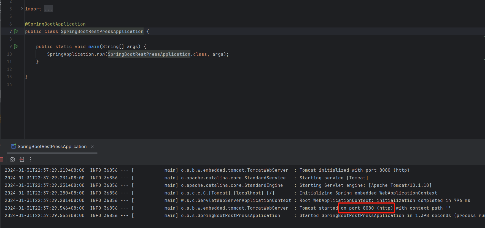
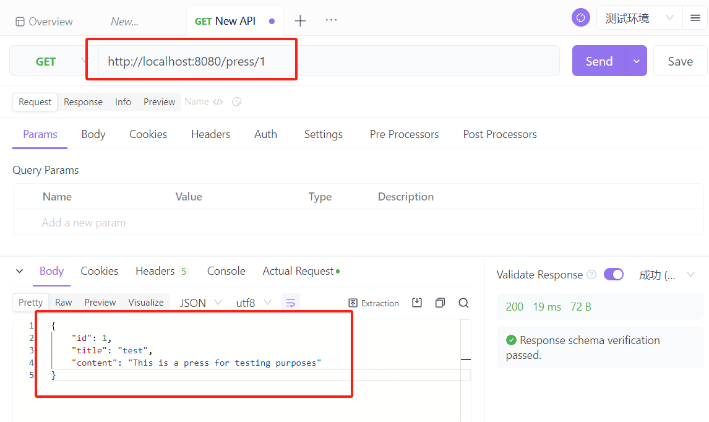

# 工程文件介绍
## 1. 项目结构
- `learnSpringBoot3[Path]`: Spring Boot入门任务1，成功启动springboot空项目
- `springBootRESTPress[Path]`: Spring Boot入门任务2，做到使用get请求访问localhost:port/press/1的时候，结合数据库CRUD技术能够以json格式返回文章数据
- `learnSpring.sql[File]`: 运行后将创建`springBootRESTPress`项目所需的`learn_spring_boot`数据库

## 2. 项目运行展示
- 任务1：
- 任务2：