# 工程文件介绍
- `newsportal[Path]`: 项目根目录

# 接口设计
本任务要求学员最后实现的后端系统，能够完成获取新闻列表、按类型索引获取新闻列表以供首页渲染，获取新闻内容、获取新闻评论内容、发布评论、上传新闻；获取开屏广告、首页弹框广告这几个核心功能对应的接口。
``` 
// 新闻
- [GET] /news -> 获取新闻列表
- [GET] /news/{nid} -> 获取新闻内容
- [GET] /news/type/{type} -> 按索引类型获取新闻列表
- [POST] /news -> 上传新闻
- [DELETE] /news/{nid} -> 删除新闻

// 评论
- [GET] /comments/{nid} -> 获取新闻评论内容
- [POST] /comments/{nid} -> 发布评论
- [DELETE] /comments/{cid} -> 删除评论

// 广告
- [GET] /ad/type/{type} -> 根据类型获取广告（开屏广告、首页弹框广告）
- [POST] /ad -> 上传广告
- [DELETE] /ad/{aid} -> 删除广告
```

# 接口测试
1. [GET] /news -> 获取新闻列表
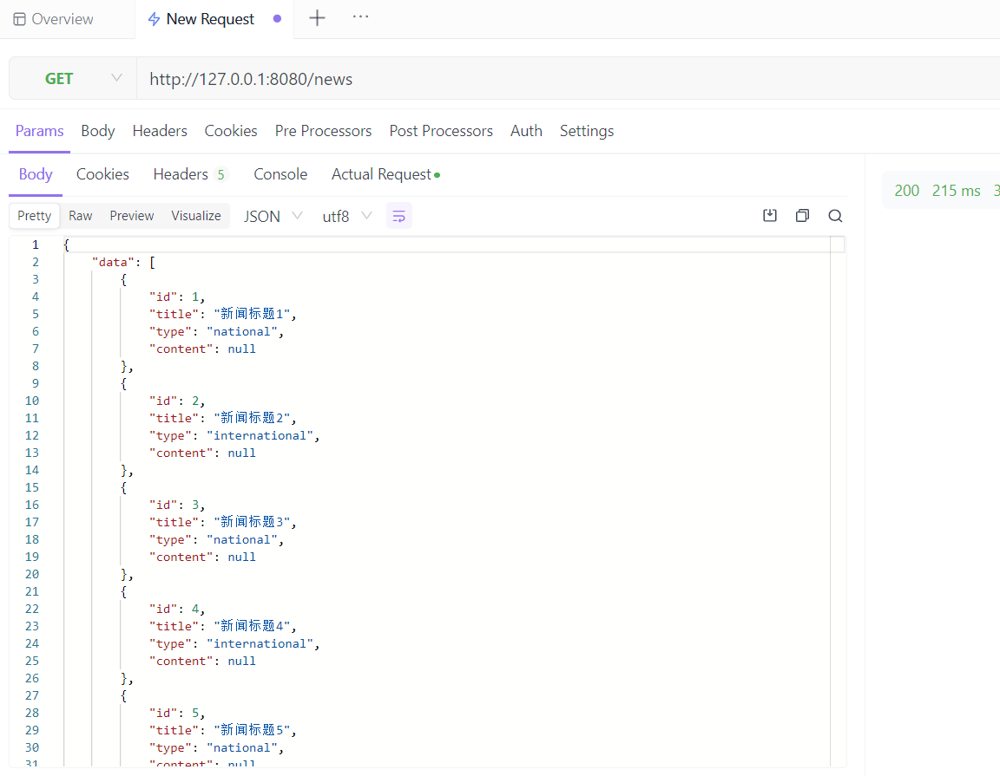
2. [GET] /news/{nid} -> 根据新闻id获取新闻内容
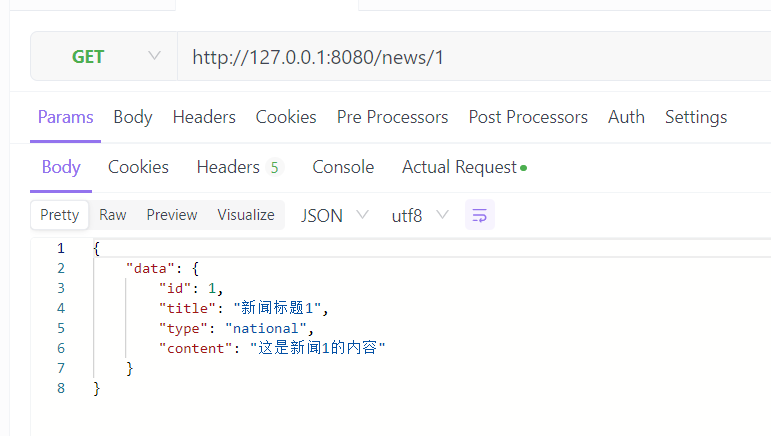
3. [GET] /news/type/{type} -> 根据新闻类型获取新闻列表
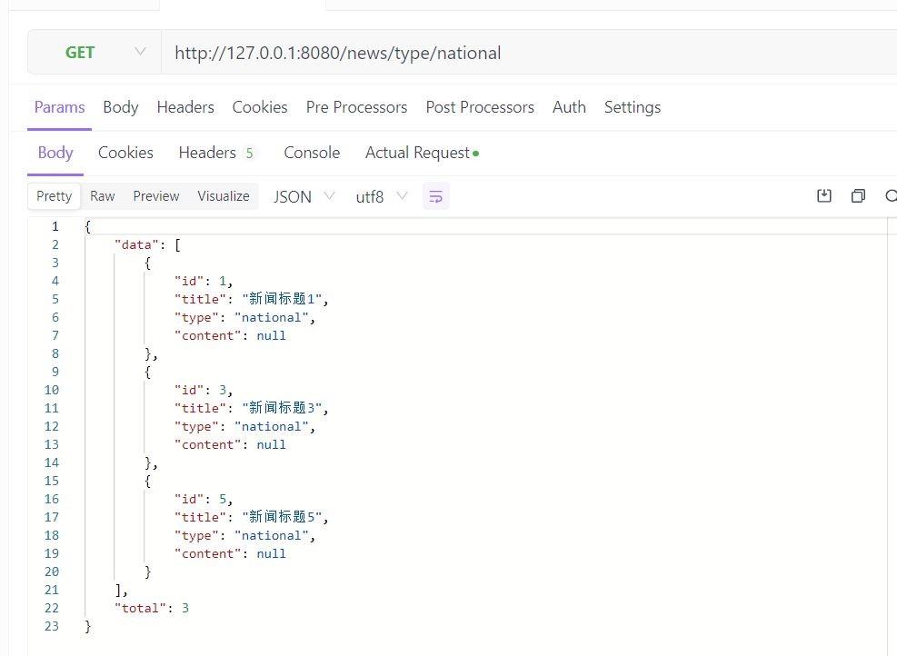
4. [POST] /news -> 上传新闻
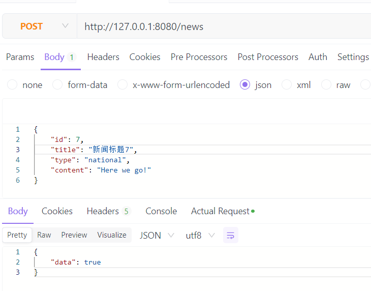
5. [DELETE] /news/{nid} -> 删除新闻
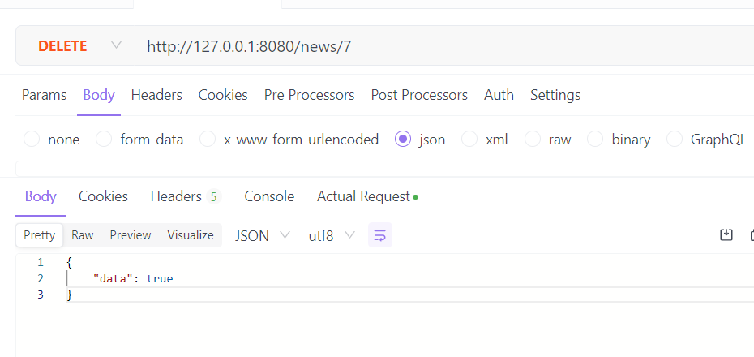
6. [GET] /comments/{nid} -> 根据新闻id获取新闻评论内容
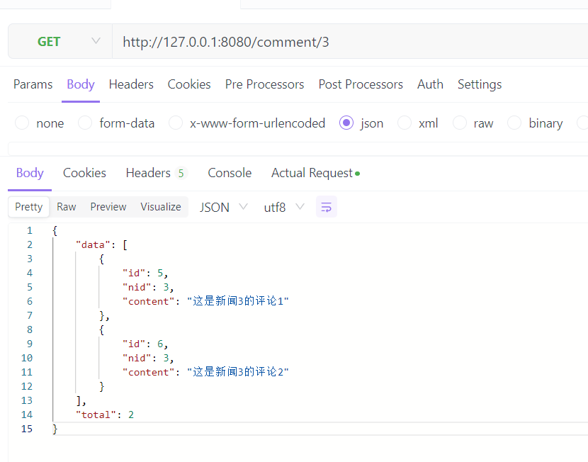
7. [POST] /comments/{nid} -> 发布评论
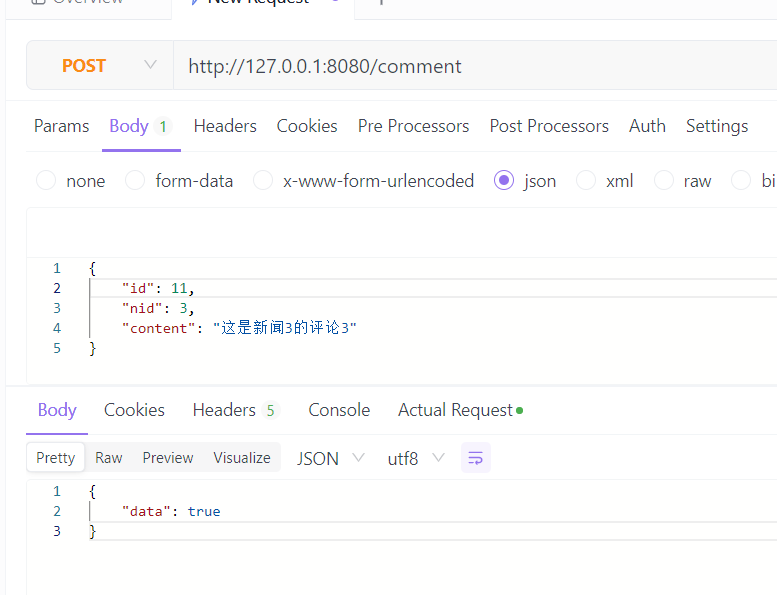
8. [DELETE] /comments/{cid} -> 删除评论
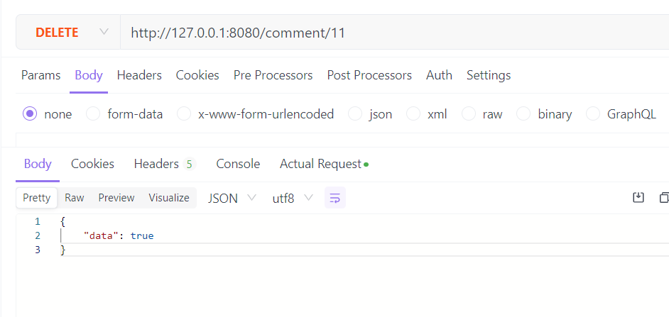
9. [GET] /ad/type/{type} -> 根据类型获取广告
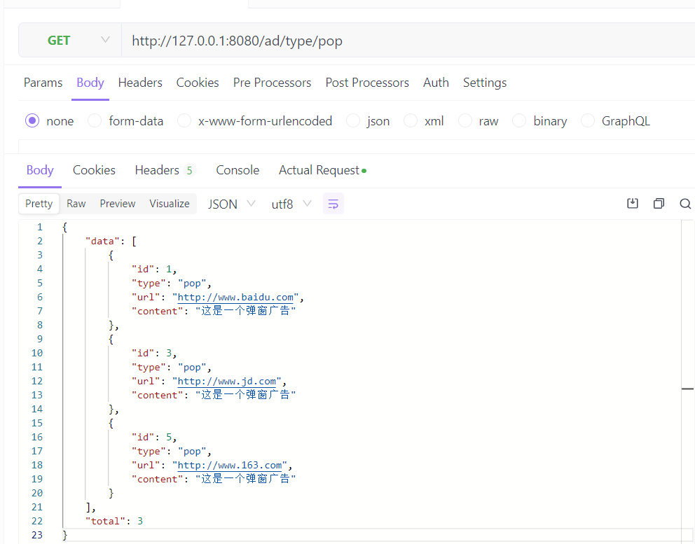
10. [POST] /ad -> 上传广告
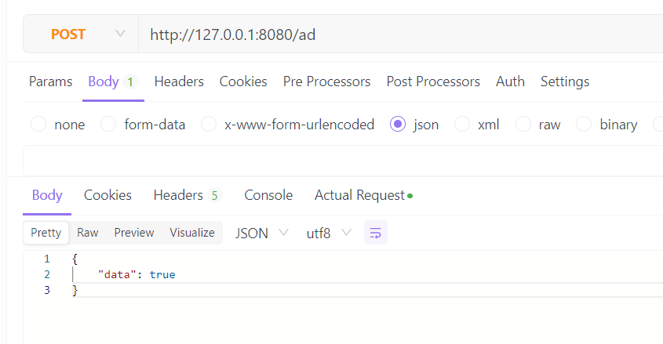
11. [DELETE] /ad/{aid} -> 删除广告
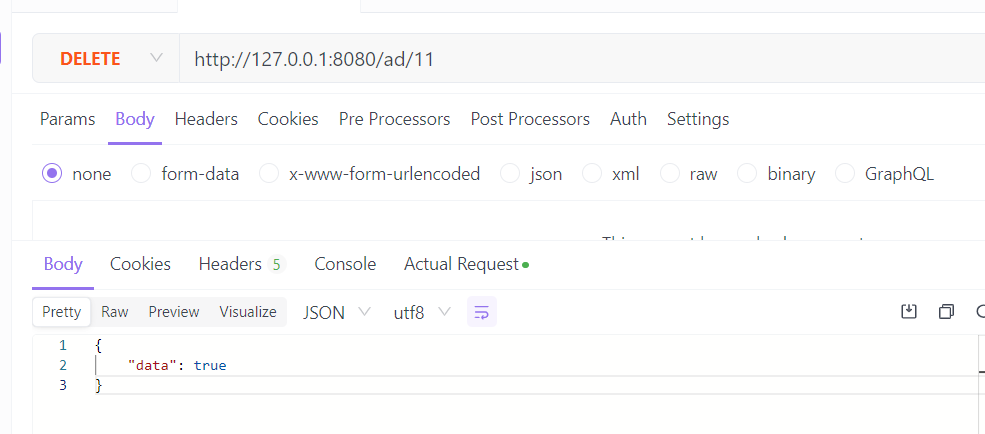