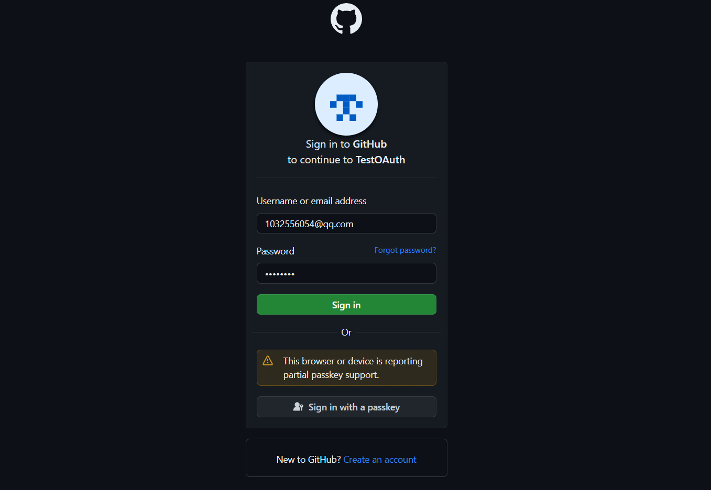
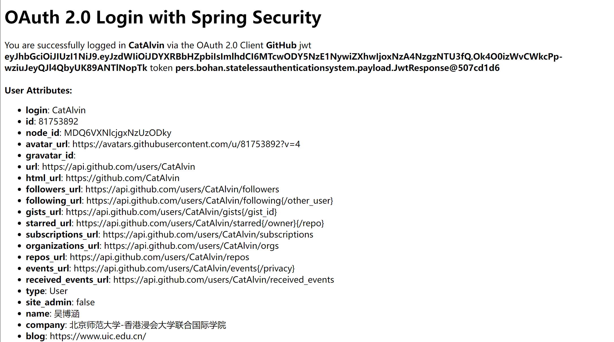

# 工程文件介绍
- `StatelessAuthenticationSystem[Path]`: 项目根目录

# 接口设计
``` 
// 新闻
- [GET] /news -> 获取新闻列表
- [GET] /news/{nid} -> 获取新闻内容
- [GET] /news/type/{type} -> 按索引类型获取新闻列表
- [POST] /news -> 上传新闻（管理员权限）
- [DELETE] /news/{nid} -> 删除新闻（管理员权限）

// 评论
- [GET] /comments/{nid} -> 获取新闻评论内容
- [POST] /comments/{nid} -> 发布评论
- [DELETE] /comments/{cid} -> 删除评论（管理员权限）

// 广告
- [GET] /ad/type/{type} -> 根据类型获取广告（开屏广告、首页弹框广告）
- [POST] /ad -> 上传广告（管理员权限）
- [DELETE] /ad/{aid} -> 删除广告（管理员权限）
```

# 任务描述
任务1
本系统的目标是搭建一个无状态的鉴权系统。为了简化用户模型，只需要引入user和admin两种类型的用户。其中user拥有常规权限，而admin能够发布文章和广告。
第一个任务是接入第三方平台的OAuth。现阶段作为练手，尝试通过搜索资料，熟练Spring Security后，在Github上创建免费的OAuth授权，并且依赖GitHub的令牌，作为用户的基本标识符。
任务2
基于JWT进行鉴权。前端JWT鉴权原理是在每个HTTP请求中，在header携带token令牌，后端收到请求后对jwt token进行有效期和权限合法性校验。当不携带token时返回无权限错误。

# 任务展示
- 无状态鉴权系统，github第三方认证

- JWT鉴权，token获取


