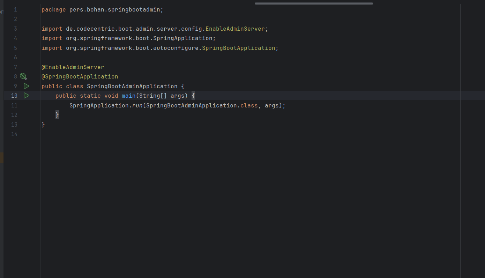
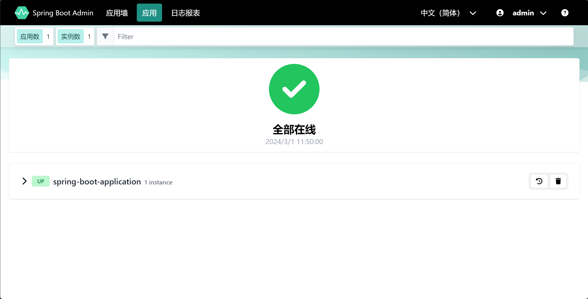
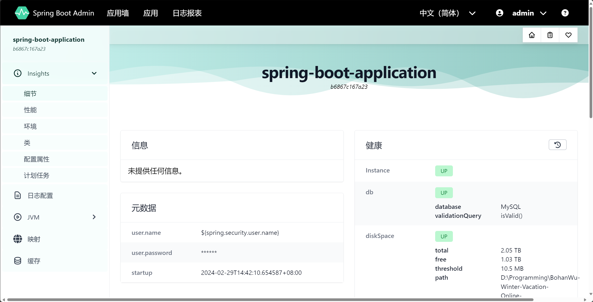
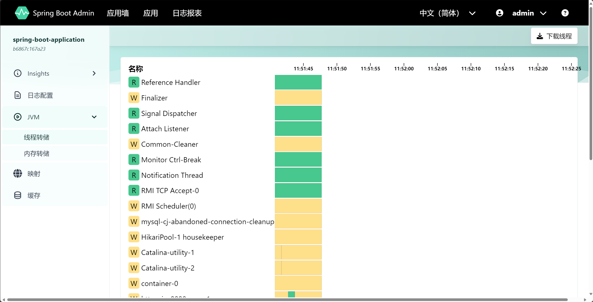
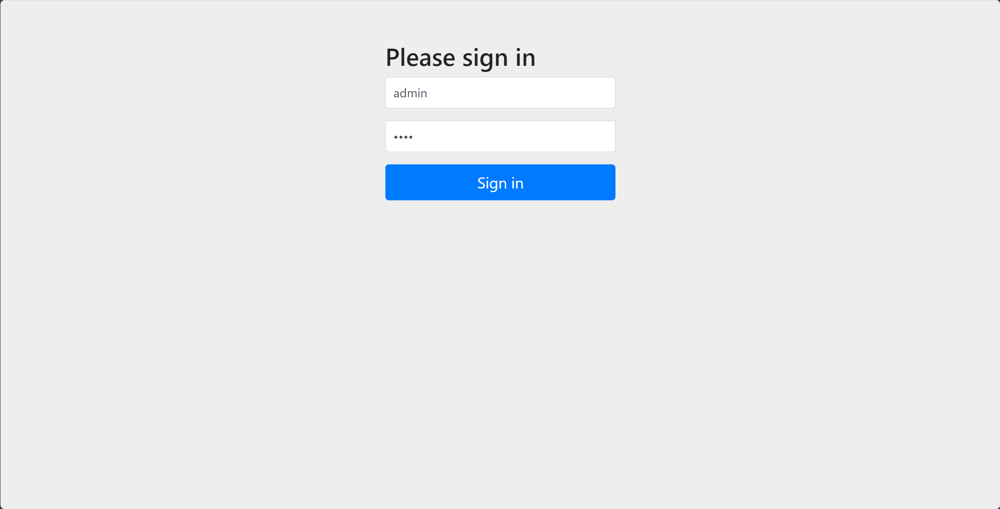

# 工程文件介绍
- `spring-boot-admin[Path]`: spring-boot-admin项目根目录
- `StatelessAuthenticationSystem[Path]`: 无状态鉴权系统项目根目录

# 接口设计
``` 
// 新闻
- [GET] /news -> 获取新闻列表
- [GET] /news/{nid} -> 获取新闻内容
- [GET] /news/type/{type} -> 按索引类型获取新闻列表
- [POST] /news -> 上传新闻（管理员权限）
- [DELETE] /news/{nid} -> 删除新闻（管理员权限）

// 评论
- [GET] /comments/{nid} -> 获取新闻评论内容
- [POST] /comments/{nid} -> 发布评论
- [DELETE] /comments/{cid} -> 删除评论（管理员权限）

// 广告
- [GET] /ad/type/{type} -> 根据类型获取广告（开屏广告、首页弹框广告）
- [POST] /ad -> 上传广告（管理员权限）
- [DELETE] /ad/{aid} -> 删除广告（管理员权限）
```

# spring-boot-admin管理员用户密码
- 用户名：admin
- 密码：1234

# 任务描述
- 任务1
完成spring-boot-admin项目的本地搭建。
- 任务2
将之前的资讯系统迁移到Spring boot admin框架中，监视其运行。
（在被监控的 Spring Boot 项目中添加 spring-boot-starter-actuator 框架的支持）
- 任务3
为Spring boot admin的管理后台添加密码验证

# 任务展示
- spring-boot-admin项目的本地搭建

- 将之前的资讯系统迁移到Spring boot admin框架中，监视其运行

- 在被监控的 Spring Boot 项目中添加 spring-boot-starter-actuator 框架的支持


- 为Spring boot admin的管理后台添加密码验证


