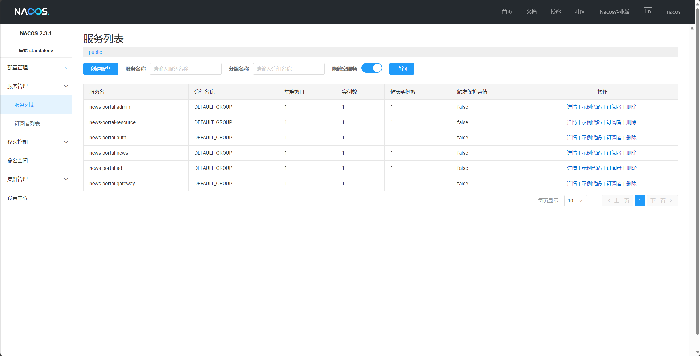

# 工程文件介绍
- `ad-service[Path]`: 广告服务项目根目录
- `news-service[Path]`: 新闻服务项目根目录
- `admin-service[Path]`: 管理员服务项目根目录
- `auth-service[Path]`: 鉴权服务项目根目录
- `gateway-service[Path]`: 网关服务项目根目录
- `resource-service[Path]`: 资源服务项目根目录
- `conf[Path]`: Nacos配置文件

# spring-boot-admin配置
- 端口：18084
- 用户名：admin
- 密码：1234

# Nacos配置
- 端口：8848
- 用户名：nacos
- 密码：nacos

# 任务描述
#### 任务1

跟随https://www.fangzhipeng.com/spring-cloud.html，搭建Spring Cloud Alibaba环境，并且按需求将nacos、sentinel等部分组件与Spring boot admin集成，然后应用在资讯门户项目中

参考：

https://www.jianshu.com/p/05ee63c5b932

https://blog.csdn.net/qq_38496561/article/details/105945386

（仅作为练习，在新闻网站上分布式属于大材小用）

#### 任务2

接下来，我们尝试将简单的新闻网站业务拆分为微服务形式重新部署。

这是市面上成熟的、开源的分布式微服务框架blade的结构。参考以上架构图和开源项目（https://gitee.com/smallc/SpringBlade），将博客项目拆分为auth、gateway、resource、user、admin、ad几个板块，并且部署到springboot-admin上。由于资讯系统十分简单，不需要其它的业务操作，这几个模块应该能够承载整个后端的运行。

# 任务展示
- nacos微服务部署

- 微服务配置信息注册

- spring-boot-admin管理各个微服务

